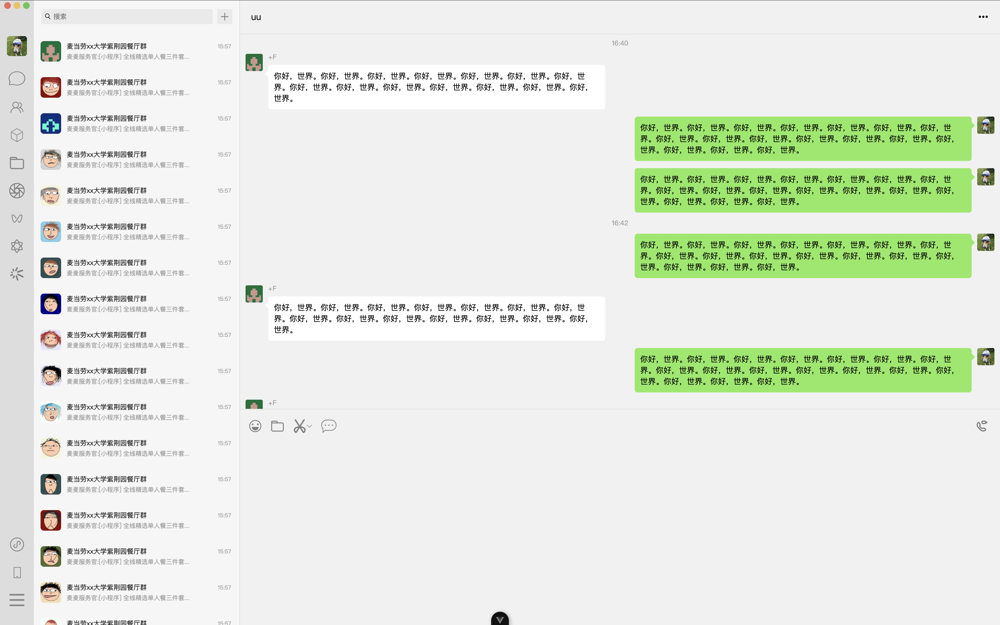

# WeChatWeb
最近学CSS, 想着模拟一下桌面端的微信练练CSS的布局.

## npm运行项目

```sh
npm install
```

```sh
npm run dev
```

## 演示


或者可以通过[GitHub Page](https://rookiemasterrr.github.io/WeChatWeb/)访问

## Star History

[](https://www.star-history.com/#RookieMasterrr/WeChatWeb&Date)